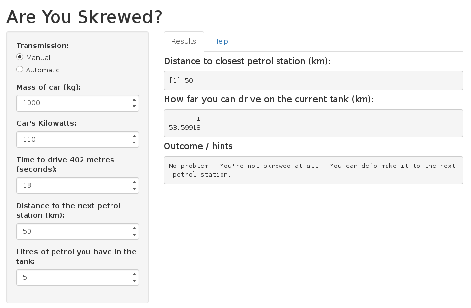

## Usage Scenario
How often have you driven down the highway, in the middle of no-where and suddenly thought to yourself "Haven't filled up in a while, I wonder if I'm skrewed."?
If your answer was "Most days", then this is the webapp for you!

Using details that everyone has at the forefront of their minds, car's transmission, car's mass, car's kilowatt output, time it takes to drive 402 metres and how many litres of fuel the car has, we can 'accurately' predict how far you can drive.

As you will see, the app also gives you helpful hints in the case that you are skrewed.

--- .class #id 

## Screenshot of the app


---

## Under the hood

The prediction function uses the mtcars dataset with `lm`, trained on transmission, weight, horsepower and quater-mile time.

```r
fit <- lm(mpg ~ transmission + wt + hp + qsec, data=mtcars)
```
Then reads in the given values to calculate the expected distance you can drive for.
For example:

```r
milesTokm(litreToGallon(5) * predict(fit, data.frame(transmission="manual",
                                                     wt=kgToThouPound(1000),
                                                     hp=kwToHP(110),
                                                     qsec=18)))
```

```
##        1 
## 53.59918
```
So with 5 litres of petrol, you can drive `53.6`km.

---

## The Real Draw-card.
This final part is what really makes the app.
You get suggestions on what to do if you are in fact skrewed!

Suggestions to increase efficiency include (among others):

- Changing your car from automatic to manual before you continue.
- Destroying your engine a bit with a hammer so that your car outputs less kilowatts.

This app is even smart enough to realise what happens when your car gets ludicrously heavy.
Indeed, a manual car of `8` tonnes (`8 000`kg), with a `110`kw engine, `18` second 402 metre time will make it to a petrol station `50`km away.
As the app correctly points out, you can make it, though you have to do it in reverse the whole way (try it for yourself!).


